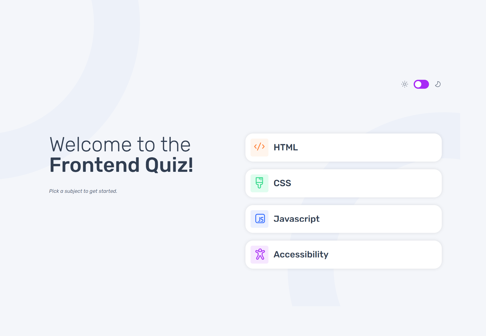

# Frontend Mentor - Solución de componentes de código QR

Esta es una solución al [desafío de Frontend Quiz app en Frontend Mentor](https://www.frontendmentor.io/challenges/frontend-quiz-app-BE7xkzXQnU). Los desafíos de Frontend Mentor ayudan a mejorar tus habilidades de programación creando proyectos realistas.

## Tabla de contenido

- [Descripción general](#descripcion-general)
  - [Captura de pantalla](#captura-de-pantalla)
  - [Links](#links)
- [Mi proceso](#mi-proceso)
  - [Llevado a cabo con](#llevado-a-cabo-con)
  - [Lo que aprendí](#lo-que-aprendi)
- [Autor](#autor)

## Descripción general
Este proyecto está desarrollado con Django y desplegado en Railway 🚀

### Captura de pantalla

### 🔗 Links
- [URL de la solución](https://www.frontendmentor.io/solutions/men-navegable-de-pgina-web-html-y-css-vUgVs_SLAZ)
- Enlace al proyecto completo 👉(https://web-production-b6c2.up.railway.app)

## Mi proceso

### 🛠 Llevado a cabo con
- Django
- HTML, SCSS, JavaScript
- Railway (despliegue backend)
- GitHub Pages (versión estática de portada)

### Lo que aprendí
Este proyecto me ha ayudado un montón en cuanto a juntar el backend como es la parte de java con el frontend, es decir, los estilos y la estructura html. He cogido mucha soltura a la hora de plantear las plantillas y de programar con django en general. Me ha gustado mucho hacer el modo oscuro, ya que es algo que nunca antes había realizado y con las variables de django no he tenido problema.

Agradezco cualquier feedback ya que me ha dado que hacer el hecho de que el cuestionario no contenga errores.

### Autor 
- GitHub - https://github.com/braismarquez2025
- Gmail - braismarquez2003@gmail.com
- Usuario de Frontend - [@braismarquez2025](https://www.frontendmentor.io/profile/braismarquez2025)

